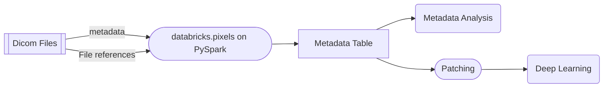

```mermaid
flowchart LR

A[[Dicom Files]] -->|metadata| B([databricks.pixels on PySpark])
B --> C[Metadata Table]
A -->|File references|B
C --> D(Metadata Analysis)
C --> E([Patching])
E --> F(Deep Learning)
```
