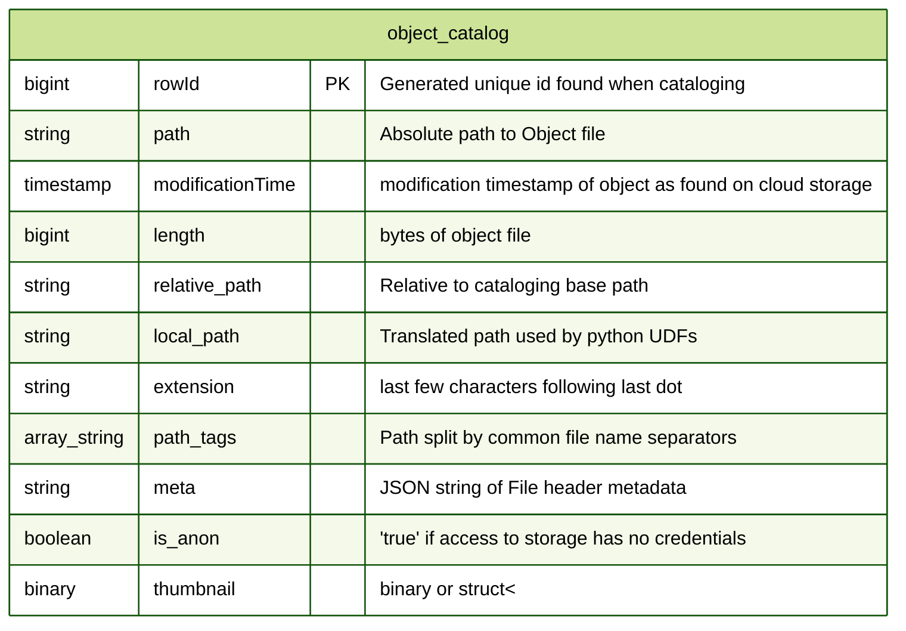

[](https://docs.databricks.com/release-notes/runtime/14.3ml.html)
[](https://cloud.google.com/databricks)
[](https://databricks.com/try-databricks)
---

# `dbx.pixels` Solution Accelerator
- Ingest and index DICOM image metadata (.dcm and from zip archives) into Delta tables for structured data analysis (SQL + ML).
- Analyze DICOM image metadata with SQL
- View and segment Dicom Images with OHIF viewer
- [MONAI](https://monai.io/) Integration, AI to automatically segment medical images and train custom models directly from the OHIF Viewer.
- Leverage Databricks' [Model Serving](https://docs.databricks.com/en/machine-learning/model-serving/index.html), hosting MONAI in serverless GPU enabled clusters for real-time segmentation.


---
## About `dbx.pixels`
Relibly turn millions of image files into SQL accessible metadata, thumbnails; Enable Deep Learning

* Use `dbx.pixels` python package for simplicity
  - Catalog your images
  - Extract Metadata
  - Visualize thumbnails
<!-- -->
* Scale up Image processing over multiple-cores and multiple worker nodes
* Delta Lake & Delta Engine accelerate metadata analysis.
* Scales well maintained 'standard' python packages `python-gdcm` `pydicom`
<!-- -->
- tags: 
dicom, dcm, pre-processing, visualization, repos, sql, python, spark, pyspark, package, image catalog, mamograms, dcm file
---
## Quick Start
Run the demo notebook [01-dcm-demo](https://github.com/databricks-industry-solutions/pixels/blob/main/01-dcm-demo.py) which does:

```python
# imports
from dbx.pixels import Catalog                              # 01
from dbx.pixels.dicom import *                              # 02

# catalog all your files
catalog = Catalog(spark)                                    # 03
catalog_df = catalog.catalog(<path>)                        # 04

# extract the Dicom metadata
meta_df = DicomMetaExtractor(catalog).transform(catalog_df) # 05
 
# extract thumbnails and display
thumbnail_df = DicomThumbnailExtractor().transform(meta_df) # 06
 
# save your work for SQL access
catalog.save(thumbnail_df)                                  # 07
```
1. Import the Catalog class from the dbx.pixels module.
2. Import all functions and classes from the dbx.pixels.dicom module.
3. Create an instance of the Catalog class, passing in the spark session.
4. Catalog all files at the specified path using the catalog method of the Catalog instance, and storing the result in the catalog_df dataframe. Replace `<path>` with the location of your files.
5. Create an instance of the DicomMetaExtractor class and call its transform method with the catalog_df DataFrame as input. This extracts the DICOM metadata.
6. Create an instance of the DicomThumbnailExtractor class and call its transform method with the meta_df DataFrame as input. This extracts the thumbnails. (Optional)
7. Save the transformed DataFrame to the catalog using the save method.
---
## Incremental processing
Pixels allows you to ingest DICOM files in a streaming fashion using [autoloader](https://docs.databricks.com/en/ingestion/auto-loader/unity-catalog.html) capability.
To enable incremental processing you need to set `streaming` and `streamCheckpointBasePath` as follows:
```python
catalog_df = catalog.catalog(path, streaming=True, streamCheckpointBasePath=<checkpointPath>)
```
---
## Built-in unzip
Automatically extracts zip files in the defined volume path.
If extractZip is not enabled then zip files will be ignored.
To enable unzip capability you need to set `extractZip`. The parameter `extractZipBasePath` is optional and the default path will be volume + /unzipped/
```python
catalog_df = catalog.catalog(path, extractZip=True, extractZipBasePath=<unzipPath>)
```
---
## OHIF Viewer
Inside Pixel resources, a pre-built version of [OHIF Viewer](https://github.com/OHIF/Viewers) with Databricks and [Unity Catalog Volumes](https://docs.databricks.com/en/sql/language-manual/sql-ref-volumes.html) extension is provided. 

All the catalog entries will be available in an easy to use study list.

Fast and multiple-layer visualization capability.


To start the OHIF Viewer web app you need to:
 - Execute the [06-OHIF-Viewer](https://github.com/databricks-industry-solutions/pixels/blob/main/06-OHIF-Viewer.py) inside a Databricks workspace.
 - Set `table` parameter with full name of you pixels catalog table. Ex: `main.pixels_solacc.object_catalog`
 - Set `sqlWarehouseID`parameter to execute the queries required to collect the records. It's the final section of the `HTTP path` in the `Connection details` tab. Use [Serverless](https://docs.databricks.com/en/admin/sql/warehouse-types.html#sql-warehouse-types) for best performance.

    

 - Use the link generated in the last notebook to access the OHIF viewer page.

---
## Save measurements and segmentations
The OHIF Viewer allows you to save back in databricks the measurements and the segmentations created in the viewer.
The metadata will be stored in the object_catalog, and the generated dicom files in the volume under the path `/ohif/exports/`.


---
## MONAILabel Integration

[MONAILabel](https://monai.io/label.html) is an open-source tool designed for interactive medical image labeling. It supports various annotation tasks such as segmentation and classification, providing a seamless experience when integrated with viewers like OHIF that is already available in this solution accelerator.


Once the server is running, you can use the OHIF Viewer to interact with your medical images. This integration allows you to leverage advanced annotation capabilities directly within your Databricks environment.

### Key Features
 - Interactive Annotation: Use AI-assisted tools for efficient labeling.
 - Seamless Integration: Work directly within Databricks using a web-based viewer.
 - Customizable Workflows: Tailor the annotation process to fit specific research needs.

### Setup Instructions
To execute the MONAILabel server is mandatory to use a cluster with Databricks Runtime Version of `14.3 LTS ML`. For the best performance use a [GPU-Enabled compute](https://docs.databricks.com/en/compute/gpu.html#gpu-enabled-compute).
#### Start the MONAILabel server
 - Execute the [05-MONAILabel](https://github.com/databricks-industry-solutions/pixels/blob/main/05-MONAILabel.py) inside a Databricks workspace.
 - Set `table` parameter with full name of you pixels catalog table. Ex: `main.pixels_solacc.object_catalog`
 - Set `sqlWarehouseID`parameter to execute the queries required to collect the records. Use [Serverless](https://docs.databricks.com/en/admin/sql/warehouse-types.html#sql-warehouse-types) for best performance.
    
#### Open the OHIF Viewer
 - Execute the notebook [06-OHIF-Viewer](https://github.com/databricks-industry-solutions/pixels/blob/main/06-OHIF-Viewer.py) to start the OHIF Viewer with the MONAILabel extension and open the generated link.
 - Select the preferred CT scan study and press on `MONAI Label` button.

    </br>
#### Connect, execute and save
 - Connect the MONAILabel server using the refresh button.

    </br>
 - Execute an auto-segmentation task using the Run button and wait for the results to be displayed.

    </br>
 - Save the final result metadata in the catalog and the generated dicom file in the volume under the path `/ohif/exports/` using the button `Export DICOM SEG`.

This setup enhances your medical image analysis workflow by combining Databricks' computing power with MONAILabel's sophisticated annotation tools.

### Model Serving Instructions

To deploy the MONAILabel server in a Model Serving endpoint we prepared [ModelServing](https://github.com/databricks-industry-solutions/pixels/blob/main/monailabel_model/ModelServing.py), a Databricks notebook designed to initialize the Databricks customized version of the **MONAILabel server** that wraps the server in an **MLflow Python custom model** and registers it for use in a **serving endpoint**.

#### Key Features

- **Model Creation**: Utilizes the MONAILabel auto segmentation model on CT AXIAL images.
- **Unity Catalog Integration**: Adds the model to the Unity Catalog for organized management.
- **Serving Endpoint Deployment**: Deploys the model in a serving endpoint for real-time inference.

---
## Design
Data Flow


---
Python Class Diagram

---
ER Diagram


___

## Installation

To run this accelerator, clone this repo into a Databricks workspace. Attach the `RUNME` notebook to any cluster running a DBR 14.3 LTS or later runtime, and execute the notebook via Run-All. A multi-step-job describing the accelerator pipeline will be created, and the link will be provided. Execute the multi-step-job to see how the pipeline runs. The job configuration is written in the RUNME notebook in json format. The cost associated with running the accelerator is the user's responsibility.

___
## Working with Unity Catalog (as of October 18th, 2023)
Unity Catalog (UC) [volumes](https://docs.databricks.com/en/data-governance/unity-catalog/create-volumes.html) are the recommended approach for providing access to and governing non-tabular data assets in a cloud object storage locations, including DICOM files. Volumes are accessed by using the following format for the path that is passed to the pixels `Catalog` object - 
```
/Volumes/<catalog>/<schema>/<volume>/<path-level-1>/...
```
where `<catalog>`, `<schema>` and `<volume>` reflect the three-level namespace of Unity Catalog. The path field returned by the `Catalog` object reflects the volume file path listed above and subsequent metadata and thumbnail extraction operations will use volumes for accessing files.

To use `databricks.pixels` with UC volumes currently requires the use of [single-user access mode clusters](https://docs.databricks.com/en/clusters/configure.html#access-modes) since `databricks.pixels` leverages user-defined functions (UDFs) and shared access mode clusters do not currently allow UDFs to access UC volumes. This behavior is expected to change in the future. When working with a UC-enabled cluster, attempting to access the cloud object store path directly by using external locations may cause errors due to the access method used by `pixels`.

___
## Contributors
- Douglas Moore @ Databricks
- Emanuele Rinaldi @ Databricks

___
## About DICOM

[Per OFFIS computer science institute](https://dicom.offis.uni-oldenburg.de/en/general/dicom-introduction/) 

DICOM® — Digital Imaging and Communications in Medicine — is the international standard for medical images and related information. It defines the formats for medical images that can be exchanged with the data and quality necessary for clinical use.

DICOM® is implemented in almost every radiology, cardiology imaging, and radiotherapy device (X-ray, CT, MRI, ultrasound, etc.), and increasingly in devices in other medical domains such as ophthalmology and dentistry. With hundreds of thousands of medical imaging devices in use, DICOM® is one of the most widely deployed healthcare messaging Standards in the world. There are literally billions of DICOM® images currently in use for clinical care.

Since its first publication in 1993, DICOM® has revolutionized the practice of radiology, allowing the replacement of X-ray film with a fully digital workflow. Much as the Internet has become the platform for new consumer information applications, DICOM® has enabled advanced medical imaging applications that have “changed the face of clinical medicine”. From the emergency department, to cardiac stress testing, to breast cancer detection, DICOM® is the standard that makes medical imaging work — for doctors and for patients.

DICOM® is recognized by the International Organization for Standardization as the ISO 12052 standard.

## Licensing

&copy; 2024 Databricks, Inc. All rights reserved. The source in this notebook is provided subject to the Databricks License [https://databricks.com/db-license-source].  All included or referenced third party libraries are subject to the licenses set forth below.

| library              | purpose                             | license                       | source                                                  |
|----------------------|-------------------------------------|-------------------------------|---------------------------------------------------------|
| dbx.pixels    | Scale out image processong Spark    | Databricks                    | https://github.com/databricks-industry-solutions/pixels |
| pydicom              | Reading Dicom file wrapper          | MIT                           | https://github.com/pydicom/pydicom                      |
| python-gdcm          | Install gdcm C++ libraries          | Apache Software License (BSD) | https://github.com/tfmoraes/python-gdcm                 |
| gdcm                 | Parse Dicom files                   | BSD                           | https://gdcm.sourceforge.net/wiki/index.php/Main_Page   |
| s3fs                 | Resolve s3:// paths                 | BSD 3-Clause                  | https://github.com/fsspec/s3fs                          |
| pandas               | Pandas UDFs                         | BSD License (BSD-3-Clause)    | https://github.com/pandas-dev/pandas                    |
| OHIF Viewer          | Medical image viewer                | MIT                           | https://github.com/OHIF/Viewers                         |
| MONAILabel           | Intelligent open source image labeling and learning tool | Apache-2.0 license  | https://github.com/Project-MONAI/MONAILabel |

