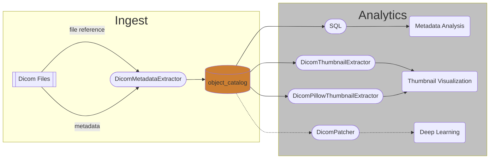
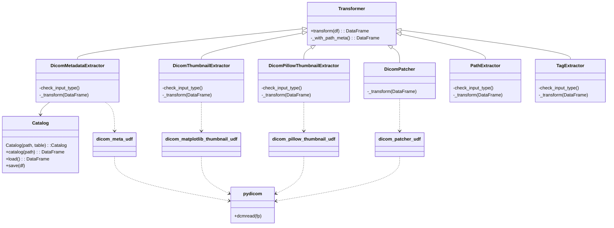
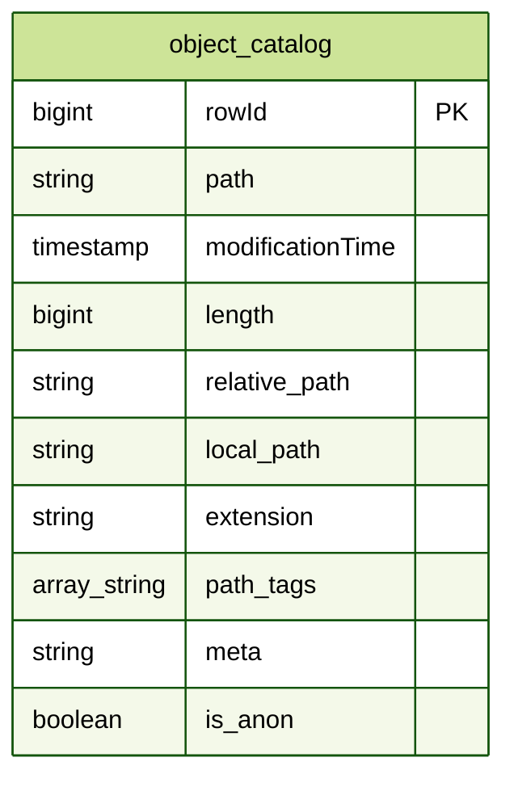

# Scale out Dicom image processing

---

## About DICOM
[Per OFFIS computer science institute](https://dicom.offis.uni-oldenburg.de/dcmintro.php.en)

DICOM® — Digital Imaging and Communications in Medicine — is the international standard for medical images and related information. It defines the formats for medical images that can be exchanged with the data and quality necessary for clinical use.

DICOM® is implemented in almost every radiology, cardiology imaging, and radiotherapy device (X-ray, CT, MRI, ultrasound, etc.), and increasingly in devices in other medical domains such as ophthalmology and dentistry. With hundreds of thousands of medical imaging devices in use, DICOM® is one of the most widely deployed healthcare messaging Standards in the world. There are literally billions of DICOM® images currently in use for clinical care.

Since its first publication in 1993, DICOM® has revolutionized the practice of radiology, allowing the replacement of X-ray film with a fully digital workflow. Much as the Internet has become the platform for new consumer information applications, DICOM® has enabled advanced medical imaging applications that have “changed the face of clinical medicine”. From the emergency department, to cardiac stress testing, to breast cancer detection, DICOM® is the standard that makes medical imaging work — for doctors and for patients.

DICOM® is recognized by the International Organization for Standardization as the ISO 12052 standard.

---
## About databricks.pixels
Process millions of files with 10 lines of code or less

* Use `databricks.pixels` python package for simplicity
  - Catalog your images
  - Extract Metadata
  - Visualize thumbnails
<!-- -->
* Scale up Image processing over multiple-cores and nodes
* Delta lake & Delta Engine accelerate metadata analysis.
* Well maintained 'standard' python packages `python-gdcm` `pydicom` are for processing Dicom files.
<!-- -->
- tags: 
dicom, dcm, pre-processing, visualization, repos, python, spark, pyspark, package, image catalog, mamograms, dcm file
---
## Design
Data Flow

---
Python Class Diagram

---
ER Diagram

___
>
    author: Douglas Moore
    email:  douglas.moore at databricks dot com
    date:   November 18, 2022
___

## Installation

To run this accelerator, clone this repo into a Databricks workspace. Attach the `RUNME` notebook to any cluster running a DBR 10.4 LTS or later runtime, and execute the notebook via Run-All. A multi-step-job describing the accelerator pipeline will be created, and the link will be provided. Execute the multi-step-job to see how the pipeline runs. The job configuration is written in the RUNME notebook in json format. The cost associated with running the accelerator is the user's responsibility.

___
## Licensing

&copy; 2022 Databricks, Inc. All rights reserved. The source in this notebook is provided subject to the Databricks License [https://databricks.com/db-license-source].  All included or referenced third party libraries are subject to the licenses set forth below.

| library              | purpose                             | license                       | source                                                  |
|----------------------|-------------------------------------|-------------------------------|---------------------------------------------------------|
| databricks.pixels    | Scale out image processong Spark    | Databricks                    | https://github.com/databricks-industry-solutions/pixels |
| pydicom              | Reading Dicom file wrapper          | MIT                           | https://github.com/pydicom/pydicom                      |
| python-gdcm          | Install gdcm C++ libraries          | Apache Software License (BSD) | https://github.com/tfmoraes/python-gdcm                 |
| gdcm                 | Manage Dicom files.                 | BSD                           | https://gdcm.sourceforge.net/wiki/index.php/Main_Page   |
| s3fs                 | Resolve s3:// paths                 | BSD 3-Clause                  | https://github.com/fsspec/s3fs                          |
| pandas               | Pandas UDFs                         | BSD License (BSD-3-Clause)    | https://github.com/pandas-dev/pandas                    |
