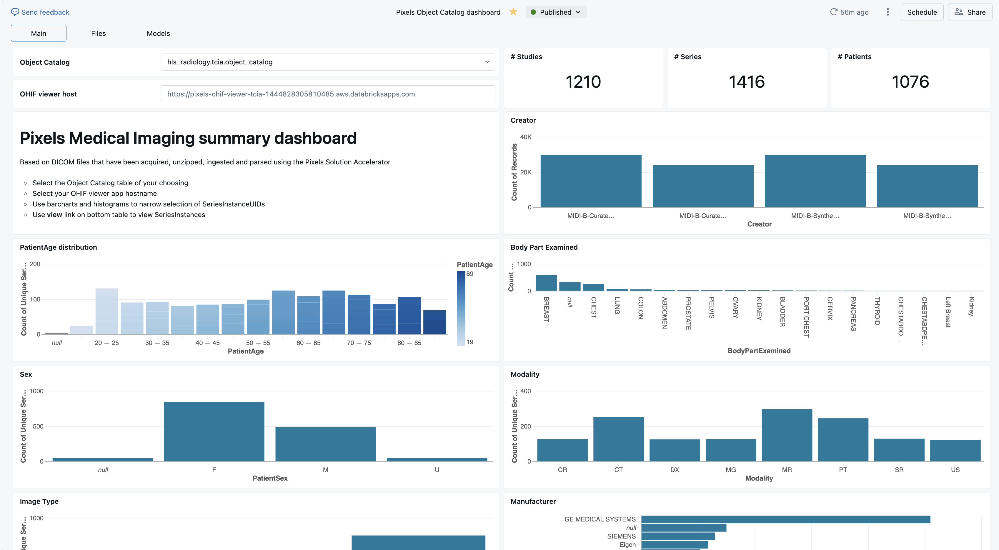

<div bgcolor="white">
  
</div>

# `pixels` Solution Accelerator
✅  Ingest and index DICOM image metadata (.dcm and from zip archives)
</br> ✅  Analyze DICOM image metadata with SQL and Machine Learning.
</br> ✅  View, segment, label DICOM Images with OHIF viewer integrated into Lakehouse Apps and Databricks security model. 
</br> ✅  One button push to launch model training from OHIF viewer.
</br> ✅  NVIDIA's [MONAI](https://docs.nvidia.com/monai/index.html) Integration, AI to automatically segment medical images and train custom models.
</br> ✅  Leverage Databricks' [Model Serving](https://docs.databricks.com/en/machine-learning/model-serving/index.html) with serverless GPU enabled clusters for real-time segmentation.

---
## Secure Lakehouse integrated DICOM Viewer powered by OHIF
</br>

---
## Run SQL queries over DICOM metadata


---
## Build Dashboards over DICOM metadata
add any features extracted too!


---
## DICOM data ingestion is easy

```python
# import Pixels Catalog (indexer) and DICOM transformers & utilities
from dbx.pixels import Catalog                              # 01
from dbx.pixels.dicom import *                              # 02

# catalog all your files
catalog = Catalog(spark)                                    # 03
catalog_df = catalog.catalog(<path>)                        # 04

# extract the DICOM metadata
meta_df = DicomMetaExtractor(catalog).transform(catalog_df) # 05

# save your work for SQL access
catalog.save(meta_df)                                       # 06
```
You'll find this example in [01-dcm-demo](https://github.com/databricks-industry-solutions/pixels/blob/main/01-dcm-demo.py) which does:

---
## Architecture


The image depicts the **Pixels Reference Solution Architecture**, which outlines a data processing and analytics framework designed for healthcare or imaging applications. Here's a breakdown of its components:

### **Key Functional Areas**
1. **AI/BI Analytics**: Supports cohort building and natural language-based analysis.
   
2. **Lakehouse Apps**: Includes an OHIF Viewer for labeling and customer-specific applications.

3. **Deep Learning**: Facilitates active learning and customer model training.

4. **Realtime Inferencing**: Implements MONAI (Medical Open Network for AI) for segmentation integration with the OHIF viewer. Customer provided proprietary models can be easily plugged in.

### **Data Flow: Batch, Incremental, Streaming Lakeflow**
The architecture processes data in stages:
1. **Acquire**: from data in ADLS, S3, GCS cloud storage as governed by Unity Catalog (UC) Volumes.  Based on customer demand, due to the composible nature of the solution accelerator, sources VNA, PACS, CIFS, AWS HealthImaging can be added as needed.
   
2. **Ingest**:  Ultimately all the DICOM files are ingested. Ingesting and producing Nifti file formats are currently on the roadmap.

3. **Extract & Index**: Unzips files, storing the extracted DICOM files into a UC volume. All of the DICOM metadata tags are extracted and stored in Databricks Data Intelligence Platform tables.

4. **Protect – Metadata**: Applies PHI (Protected Health Information) redaction via format preserving encryption to all necessary tags.

5. **Protect – Image**: Ensures PHI redaction for pixel-level data. This is under active integration based on work Databricks has done in previous solution accelerators.

6. **Inferencing**: Utilizes industry-standard models pre-trained MONAI open source models sponsored by NVIDIA. Similarly, customers can fine tune the MONAI models or bring their own segmentation or featurization models.

### **Supporting Layers**
- **Governance Layer**: Unity Catalog provides data access controls, automatic capture of data lineage (including models)
  
- **Customer’s Cloud Storage**: Stores object indexes, folders, and ML models in open formats in customer's account.
  
- **Open Access**: Provides APIs, SQL connections, Spark integration, and credential vending via Delta Sharing.

This architecture is designed to handle healthcare imaging data securely while enabling advanced analytics and AI-driven insights.


---
## Getting started

To run this accelerator, clone this repo into a Databricks workspace. Attach the `RUNME` notebook to Serverless Compute or any cluster running a DBR 16.4 LTS or later runtime, and execute the notebook via Run-All. A multi-step-job describing the accelerator pipeline will be created, and the link will be provided. Execute the multi-step-job to see how the pipeline runs. The job configuration is written in the RUNME notebook in json format. The cost associated with running the accelerator is the user's responsibility.

## Incremental processing
Pixels allows you to ingest DICOM files in a streaming fashion using [autoloader](https://docs.databricks.com/en/ingestion/auto-loader/unity-catalog.html) capability.
To enable incremental processing you need to set `streaming` and `streamCheckpointBasePath` as follows:
```python
catalog_df = catalog.catalog(path, streaming=True, streamCheckpointBasePath=<checkpointPath>)
```

## Built-in unzip
Automatically extracts zip files in the defined volume path.
If extractZip is not enabled then zip files will be ignored.
To enable unzip capability you need to set `extractZip`. The parameter `extractZipBasePath` is optional and the default path will be volume + /unzipped/
```python
catalog_df = catalog.catalog(path, extractZip=True, extractZipBasePath=<unzipPath>)
```

## Metadata Anonymization
Pixels provides a feature to anonymize DICOM metadata to ensure patient privacy and compliance with regulations. This feature can be enabled during the cataloging process. An example can be explored in the [03-Metadata-DeIdentification](https://github.com/databricks-industry-solutions/pixels/blob/main/03-Metadata-DeIdentification.py) notebook.

To enable metadata anonymization, you can use the following extractor:
```python
metadata_df = DicomMetaAnonymizerExtractor(
   catalog,
   anonym_mode="METADATA",
   fp_key=<fp_key>, #ONLY HEX STRING ALLOWED - 128, 192 or 256 bits
   fp_tweak=<fp_tweak>,   #ONLY HEX STRING ALLOWED - 64 bits
   anonymization_base_path=<anonym_path>
).transform(catalog_df)
```
`fp_key` is the format preserving encryption key used to ensure that the anonymization process is consistent across different runs. This key is used to generate pseudonyms for sensitive data fields, ensuring that the same input value always maps to the same pseudonym. This is useful for maintaining the ability to link records across datasets without revealing the original sensitive information.

`fp_tweak` is an optional parameter that can be used to add an additional layer of randomness to the pseudonymization process. This can be useful for further enhancing privacy.

By setting the `anonym_mode` parameter to `"METADATA"`, the DICOM metadata will be anonymized during the ingestion process. This ensures that sensitive patient information is not stored in the catalog.
The default configuration will save the anonymized DICOM files under `anonymization_base_path` property's path.

---
## OHIF Viewer
Inside `dbx.pixels` resources folder, a pre-built version of [OHIF Viewer](https://github.com/OHIF/Viewers) with Databricks and [Unity Catalog Volumes](https://docs.databricks.com/en/sql/language-manual/sql-ref-volumes.html) extension is provided. 

All the catalog entries will be available in an easy to use study list.

Fast and multiple-layer visualization capability.


To start the OHIF Viewer web app you need to:
 - Execute the [06-OHIF-Viewer](https://github.com/databricks-industry-solutions/pixels/blob/main/06-OHIF-Viewer.py) inside a Databricks workspace.
 - Set the `table` parameter to the full name of your Pixels catalog table. Ex: `main.pixels_solacc.object_catalog`
 - Set the `sqlWarehouseID`parameter to execute the queries required to collect the records. It's the final section of the `HTTP path` in the `Connection details` tab. Use [Serverless](https://docs.databricks.com/en/admin/sql/warehouse-types.html#sql-warehouse-types) for best performance.

    

 - Use the link generated in the last notebook to access the OHIF viewer page.

## Save measurements and segmentations
The OHIF Viewer allows you to save back to Databricks the measurements and the segmentations created in the viewer.
The metadata will be stored in the object_catalog, and the generated dicom files in the volume under the path `/ohif/exports/`.


## MONAILabel Integration

[MONAILabel](https://monai.io/label.html) is an open-source tool designed for interactive medical image labeling. It supports various annotation tasks such as segmentation and classification, providing a seamless experience when integrated with viewers like OHIF that is already available in this solution accelerator.


Once the server is running, you can use the OHIF Viewer to interact with your medical images. This integration allows you to leverage advanced annotation capabilities directly within your Databricks environment.

### Key Features
 - Interactive Annotation: Use AI-assisted tools for efficient labeling.
 - Seamless Integration: Work directly within Databricks using a web-based viewer.
 - Customizable Workflows: Tailor the annotation process to fit specific research needs.

### MONAILabel Setup Instructions
To execute the MONAILabel server it is mandatory to use a cluster with Databricks Runtime Version of `14.3 LTS ML`. For the best performance use a [GPU-Enabled compute](https://docs.databricks.com/en/compute/gpu.html#gpu-enabled-compute).
#### Start the MONAILabel server
 - Execute the [05-MONAILabel](https://github.com/databricks-industry-solutions/pixels/blob/main/05-MONAILabel.py) inside a Databricks workspace.
 - Set the `table` parameter to the full name of your Pixels catalog table. Ex: `main.pixels_solacc.object_catalog`
 - Set the `sqlWarehouseID`parameter to the DBSQL Warehouse ID, needed to run queries required to collect the records. Use [Serverless](https://docs.databricks.com/en/admin/sql/warehouse-types.html#sql-warehouse-types) for best performance.
    
#### Open the OHIF Viewer
 - Execute the notebook [06-OHIF-Viewer](https://github.com/databricks-industry-solutions/pixels/blob/main/06-OHIF-Viewer.py) to start the OHIF Viewer with the MONAILabel extension and open the generated link.
 - Select the preferred CT scan study and press the `MONAI Label` button.

    </br>
#### Connect, execute and save
 - Connect the MONAILabel server using the refresh button.

    </br>
 - Execute an auto-segmentation task using the Run button and wait for the results to be displayed.

    </br>
 - Save the final result metadata in the catalog and the generated dicom file in the volume under the path `/ohif/exports/` using the button `Export DICOM SEG`.

This setup enhances your medical image analysis workflow by combining Databricks' computing power with MONAILabel's sophisticated annotation tools.

### Model Serving Instructions

To deploy the MONAILabel server in a Model Serving endpoint we prepared [ModelServing](https://github.com/databricks-industry-solutions/pixels/blob/main/monailabel_model/ModelServing.py), a Databricks notebook designed to initialize the Databricks customized version of the **MONAILabel server** that wraps the server in an **MLflow Python custom model** and registers it for use in a **serving endpoint**.

#### Key Features

- **Model Creation**: Utilizes the MONAILabel auto segmentation model on CT AXIAL images.
- **Unity Catalog Integration**: Adds the model to the Unity Catalog for organized management.
- **Serving Endpoint Deployment**: Deploys the model in a serving endpoint for real-time inference.

#### Auto Segmentation with Lakehouse App and Serving Endpoint

https://github.com/user-attachments/assets/8cf62378-ab39-4a89-86ad-c2f231b7a524

#### Active Learning

https://github.com/user-attachments/assets/17142752-d9b9-434b-b893-b6bc05080f54


## Working with Unity Catalog
Unity Catalog (UC) [volumes](https://docs.databricks.com/en/data-governance/unity-catalog/create-volumes.html) are the recommended approach for providing access to and governing non-tabular data assets in a cloud object storage locations, including DICOM files. Volumes are accessed by using the following format for the path that is passed to the pixels `Catalog` object - 
```
/Volumes/<catalog>/<schema>/<volume>/<path-level-1>/...
```
where `<catalog>`, `<schema>` and `<volume>` reflect the three-level namespace of Unity Catalog. The path field returned by the `Catalog` object reflects the volume file path listed above and subsequent metadata and thumbnail extraction operations will use volumes for accessing files.

DICOM file Ingestion works with Shared, Dedicated and Serverless Compute types.

---
## Contributors
- Douglas Moore @ Databricks
- Emanuele Rinaldi @ Databricks
- Nicole Jingting Lu @ Databricks
- Krishanu Nandy @ Databricks
- May Merkle-Tan @ Databricks
- Ben Russoniello @ Prominence Advisors
- Cal Reynolds @ Databricks


## About `dbx.pixels`
Relibly turn millions of image files into SQL accessible metadata, thumbnails; Enable Deep Learning, AI/BI Dashboarding, Genie Spaces.

- tags: 
dicom, dcm, pre-processing, visualization, repos, sql, python, spark, pyspark, package, image catalog, mamograms, dcm file
---

## About DICOM

[Per OFFIS computer science institute](https://dicom.offis.uni-oldenburg.de/en/general/dicom-introduction/) 

DICOM® — Digital Imaging and Communications in Medicine — is the international standard for medical images and related information. It defines the formats for medical images that can be exchanged with the data and quality necessary for clinical use.

DICOM® is implemented in almost every radiology, cardiology imaging, and radiotherapy device (X-ray, CT, MRI, ultrasound, etc.), and increasingly in devices in other medical domains such as ophthalmology and dentistry. With hundreds of thousands of medical imaging devices in use, DICOM® is one of the most widely deployed healthcare messaging Standards in the world. There are literally billions of DICOM® images currently in use for clinical care.

Since its first publication in 1993, DICOM® has revolutionized the practice of radiology, allowing the replacement of X-ray film with a fully digital workflow. Much as the Internet has become the platform for new consumer information applications, DICOM® has enabled advanced medical imaging applications that have “changed the face of clinical medicine”. From the emergency department, to cardiac stress testing, to breast cancer detection, DICOM® is the standard that makes medical imaging work — for doctors and for patients.

DICOM® is recognized by the International Organization for Standardization as the ISO 12052 standard.

## Licensing

&copy; 2024 Databricks, Inc. All rights reserved. The source in this notebook is provided subject to the Databricks License [https://databricks.com/db-license-source].  All included or referenced third party libraries are subject to the licenses set forth below.

| library              | purpose                             | license                       | source                                                  |
|----------------------|-------------------------------------|-------------------------------|---------------------------------------------------------|
| dbx.pixels           | Scale out image processing library  | Databricks                    | https://github.com/databricks-industry-solutions/pixels |
| pydicom              | Python api for DICOM files          | MIT                           | https://github.com/pydicom/pydicom                      |
| python-gdcm          | Install gdcm C++ libraries          | Apache Software License (BSD) | https://github.com/tfmoraes/python-gdcm                 |
| gdcm                 | Parse DICOM files                   | BSD                           | https://sourceforge.net/projects/gdcm                   |
| s3fs                 | Resolve s3:// paths                 | BSD 3-Clause                  | https://github.com/fsspec/s3fs                          |
| pandas               | Pandas UDFs                         | BSD License (BSD-3-Clause)    | https://github.com/pandas-dev/pandas                    |
| OHIF Viewer          | Medical image viewer                | MIT                           | https://github.com/OHIF/Viewers                         |
| MONAILabel           | Intelligent open source image labeling and learning tool | Apache-2.0 license  | https://github.com/Project-MONAI/MONAILabel |
| DICOGNITO            | A library and command line tool for anonymizing DICOM files | MIT  | https://github.com/blairconrad/dicognito |
| FF3                  | FPE - Format Preserving Encryption with FF3 in Python | Apache-2.0 license  | https://github.com/mysto/python-fpe |
| Vista3D              | MONAI Versatile Imaging SegmenTation and Annotation model | Apache-2.0 license (code) - NCLS v1 (model weight) | https://github.com/Project-MONAI/VISTA/tree/main/vista3d |


