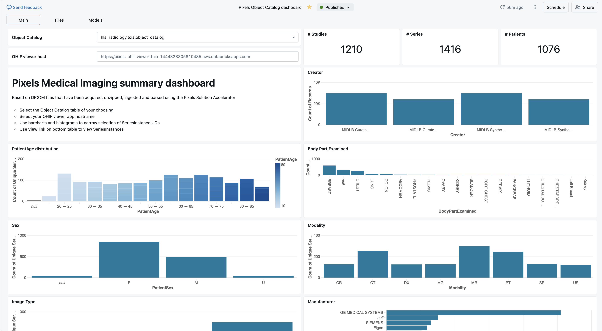

<div bgcolor="white" style="display: flex;">
  
  
</div>

# `pixels` Solution Accelerator
✅  Ingest and index DICOM image metadata (.dcm and from zip archives)
</br> ✅  Analyze DICOM image metadata with SQL and Machine Learning.
</br> ✅  View, segment, label DICOM Images with OHIF viewer integrated into Lakehouse Apps and Databricks security model. 
</br> ✅  One button push to launch model training from OHIF viewer.
</br> ✅  NVIDIA's [MONAI](https://docs.nvidia.com/monai/index.html) Integration, AI to automatically segment medical images and train custom models.
</br> ✅  Leverage Databricks' [Model Serving](https://docs.databricks.com/en/machine-learning/model-serving/index.html) with serverless GPU enabled clusters for real-time segmentation.
</br> ✅  NIfTI segmentation overlays — load `.nii.gz` masks (Vista3D, MONAI, manual) on top of DICOM volumes in OHIF, served from a Delta-table-backed gateway with UC ACLs end-to-end.

---
## Secure Lakehouse integrated DICOM Viewer powered by OHIF
</br>

---
## Run SQL queries over DICOM metadata


---
## Build Dashboards over DICOM metadata
add any features extracted too!


---
## DICOM data ingestion is easy

```python
# import Pixels Catalog (indexer) and DICOM transformers & utilities
from dbx.pixels import Catalog                              # 01
from dbx.pixels.dicom import *                              # 02

# catalog all your files
catalog = Catalog(spark)                                    # 03
catalog_df = catalog.catalog(<path>)                        # 04

# extract the DICOM metadata
meta_df = DicomMetaExtractor(catalog).transform(catalog_df) # 05

# save your work for SQL access
catalog.save(meta_df)                                       # 06
```
You'll find this flow in the install job task [`install/dcm-demo.ipynb`](https://github.com/databricks-industry-solutions/pixels/blob/main/install/dcm-demo.ipynb), which the DAB install runs automatically.

---
## Architecture


The image depicts the **Pixels Reference Solution Architecture**, which outlines a data processing and analytics framework designed for healthcare or imaging applications. Here's a breakdown of its components:

### **Key Functional Areas**
1. **AI/BI Analytics**: Supports cohort building and natural language-based analysis.
   
2. **Lakehouse Apps**: Includes an OHIF Viewer for labeling and customer-specific applications.

3. **Deep Learning**: Facilitates active learning and customer model training.

4. **Realtime Inferencing**: Implements MONAI (Medical Open Network for AI) for segmentation integration with the OHIF viewer. Customer provided proprietary models can be easily plugged in.

### **Data Flow: Batch, Incremental, Streaming Lakeflow**
The architecture processes data in stages:
1. **Acquire**: from data in ADLS, S3, GCS cloud storage as governed by Unity Catalog (UC) Volumes.  Based on customer demand, due to the composible nature of the solution accelerator, sources VNA, PACS, CIFS, AWS HealthImaging can be added as needed.
   
2. **Ingest**:  Ultimately all the DICOM files are ingested. Ingesting and producing Nifti file formats are currently on the roadmap.

3. **Extract & Index**: Unzips files, storing the extracted DICOM files into a UC volume. All of the DICOM metadata tags are extracted and stored in Databricks Data Intelligence Platform tables.

4. **Protect – Metadata**: Applies PHI (Protected Health Information) redaction via format preserving encryption to all necessary tags.

5. **Protect – Image**: Ensures PHI redaction for pixel-level data. This is under active integration based on work Databricks has done in previous solution accelerators.

6. **Inferencing**: Utilizes industry-standard models pre-trained MONAI open source models sponsored by NVIDIA. Similarly, customers can fine tune the MONAI models or bring their own segmentation or featurization models.

### **Supporting Layers**
- **Governance Layer**: Unity Catalog provides data access controls, automatic capture of data lineage (including models)
  
- **Customer’s Cloud Storage**: Stores object indexes, folders, and ML models in open formats in customer's account.
  
- **Open Access**: Provides APIs, SQL connections, Spark integration, and credential vending via Delta Sharing.

This architecture is designed to handle healthcare imaging data securely while enabling advanced analytics and AI-driven insights.

## DICOMweb Apps Reference
For the Databricks Apps architecture and operations guide (viewer app, gateway app,
QIDO/WADO/STOW implementation, caching, metrics, and config reference), see:

- [`docs/DICOMWEB.md`](docs/DICOMWEB.md) — DICOMweb (QIDO/WADO/STOW) architecture, caching tiers, metrics
- [`docs/NIFTI_OVERLAY.md`](docs/NIFTI_OVERLAY.md) — Optional NIfTI segmentation overlay feature (OHIF extension, gateway routes, Delta schema, deployment)

The notebook-driven OHIF/MONAI sections in this README remain valid for interactive
workspace workflows. For production DICOMweb deployments with the split
`dicom_web` + `dicom_web_gateway` Databricks Apps architecture, use
`docs/DICOMWEB.md` as the source of truth.


---
## Getting started

See **[docs/INSTALL.md](docs/INSTALL.md)** for complete installation instructions using Databricks Asset Bundles.

- **Simplest ingestion-only demo**: ~5–10 minutes
- **Full install** (UC + Lakebase + apps + GPU model serving + Genie + dashboard): ~30–45 minutes

## Incremental processing
Pixels allows you to ingest DICOM files in a streaming fashion using [autoloader](https://docs.databricks.com/en/ingestion/auto-loader/unity-catalog.html) capability.
To enable incremental processing you need to set `streaming` and `streamCheckpointBasePath` as follows:
```python
catalog_df = catalog.catalog(path, streaming=True, streamCheckpointBasePath=<checkpointPath>)
```

### Optional: managed file events with Auto Loader
For higher scalability, you can enable managed file events for discovery instead of directory listing.

```python
catalog_df = catalog.catalog(
  path,
  streaming=True,
  streamCheckpointBasePath=<checkpointPath>,
  useManagedFileEvents=True,
  includeExistingFiles=True,
  allowOverwrites=False,
  maxFileAge="90 days"
)
```

Best practices:
- Use Unity Catalog Volumes or external locations governed by Unity Catalog.
- Ensure the stream runs at least once every 7 days to keep file events warm.
- Keep `allowOverwrites=False` unless upstream systems can overwrite files.
- Use `maxFileAge` to bound discovery windows for large/high-churn landing zones.
- Reuse a stable checkpoint path across runs to avoid reprocessing.

## Built-in unzip
Automatically extracts zip files in the defined volume path.
If extractZip is not enabled then zip files will be ignored.
To enable unzip capability you need to set `extractZip`. The parameter `extractZipBasePath` is optional and the default path will be volume + /unzipped/
```python
catalog_df = catalog.catalog(path, extractZip=True, extractZipBasePath=<unzipPath>)
```

## Metadata Anonymization
Pixels provides a feature to anonymize DICOM metadata to ensure patient privacy and compliance with regulations. This feature can be enabled during the cataloging process. An example can be explored in the [03-Metadata-DeIdentification](https://github.com/databricks-industry-solutions/pixels/blob/main/notebooks/03-Metadata-DeIdentification.py) notebook.

To enable metadata anonymization, you can use the following extractor:
```python
metadata_df = DicomMetaAnonymizerExtractor(
   catalog,
   anonym_mode="METADATA",
   fp_key=<fp_key>, #ONLY HEX STRING ALLOWED - 128, 192 or 256 bits
   fp_tweak=<fp_tweak>,   #ONLY HEX STRING ALLOWED - 64 bits
   anonymization_base_path=<anonym_path>
).transform(catalog_df)
```
`fp_key` is the format preserving encryption key used to ensure that the anonymization process is consistent across different runs. This key is used to generate pseudonyms for sensitive data fields, ensuring that the same input value always maps to the same pseudonym. This is useful for maintaining the ability to link records across datasets without revealing the original sensitive information.

`fp_tweak` is an optional parameter that can be used to add an additional layer of randomness to the pseudonymization process. This can be useful for further enhancing privacy.

By setting the `anonym_mode` parameter to `"METADATA"`, the DICOM metadata will be anonymized during the ingestion process. This ensures that sensitive patient information is not stored in the catalog.
The default configuration will save the anonymized DICOM files under `anonymization_base_path` property's path.

## Remove UN Tags
DICOM files can contain elements with Value Representation `UN` (Unknown), which are tags that could not be resolved to a specific VR during parsing. These tags often carry unstructured or proprietary data that can bloat the extracted metadata, cause serialization issues, or introduce noise in downstream analytics.

Pixels provides a built-in option to strip all `UN` VR elements from the dataset before metadata extraction. The removal is recursive, so `UN` elements nested inside sequences (`SQ`) are also cleaned up.

To enable this feature, set `remove_un_tags=True` on the `DicomMetaExtractor`:
```python
from dbx.pixels import Catalog
from dbx.pixels.dicom import *

catalog = Catalog(spark)
catalog_df = catalog.catalog(<path>)

meta_df = DicomMetaExtractor(
    catalog,
    remove_un_tags=True
).transform(catalog_df)

catalog.save(meta_df)
```

## Permissive Mode
When processing DICOM files at scale, some files may produce metadata JSON that cannot be parsed by Spark's `parse_json()` function — for example, tags with very long `InlineBinary` values. By default, this causes the stream or batch to fail with a `MALFORMED_RECORD_IN_PARSING` error.

Setting `permissive=True` switches to `try_parse_json()`, which returns `NULL` instead of failing. A `_corrupt_record` column is added containing the raw JSON string for any rows that failed to parse, so you can inspect and triage them.

```python
from dbx.pixels import Catalog
from dbx.pixels.dicom import *

catalog = Catalog(spark)
catalog_df = catalog.catalog(<path>, streaming=True)

meta_df = DicomMetaExtractor(
    catalog,
    permissive=True
).transform(catalog_df)

catalog.save(meta_df)
```

The `permissive` parameter is also available on `DicomAnonymizerExtractor`.

---
## OHIF Viewer & MONAILabel auto-segmentation

OHIF Viewer and MONAILabel auto-segmentation are deployed by the DAB install job — no notebook execution required:

- **`pixels-dicomweb` app** — OHIF viewer + MONAI proxy + measurements/segmentations export to UC Volume (`/ohif/exports/`)
- **`pixels-dicomweb-gateway` app** — DICOMweb QIDO/WADO/STOW server backed by Lakebase, plus optional NIfTI segmentation overlay routes
- **`pixels-monai-uc` model serving endpoint** — Vista3D / MONAILabel inference on Databricks-managed GPU
- **NIfTI segmentation overlay** (optional) — gateway exposes `GET /api/dicomweb/nifti/{related,fetch}` over a Delta-table-backed registry of `.nii.gz` masks; the OHIF viewer ships an `@ohif/extension-nifti-segmentation` panel that lists, fetches, aligns, and injects them as labelmaps. Enable by setting the `nifti_segmentation_table` bundle variable.

See [docs/INSTALL.md](docs/INSTALL.md) for deployment, [docs/DICOMWEB.md](docs/DICOMWEB.md) for the DICOMweb apps architecture and operations guide, and [docs/NIFTI_OVERLAY.md](docs/NIFTI_OVERLAY.md) for the NIfTI overlay feature.

#### Auto Segmentation with Lakehouse App and Serving Endpoint

https://github.com/user-attachments/assets/8cf62378-ab39-4a89-86ad-c2f231b7a524

#### Active Learning

https://github.com/user-attachments/assets/17142752-d9b9-434b-b893-b6bc05080f54


## Working with Unity Catalog
Unity Catalog (UC) [volumes](https://docs.databricks.com/en/data-governance/unity-catalog/create-volumes.html) are the recommended approach for providing access to and governing non-tabular data assets in a cloud object storage locations, including DICOM files. Volumes are accessed by using the following format for the path that is passed to the pixels `Catalog` object - 
```
/Volumes/<catalog>/<schema>/<volume>/<path-level-1>/...
```
where `<catalog>`, `<schema>` and `<volume>` reflect the three-level namespace of Unity Catalog. The path field returned by the `Catalog` object reflects the volume file path listed above and subsequent metadata and thumbnail extraction operations will use volumes for accessing files.

DICOM file Ingestion works with Shared, Dedicated and Serverless Compute types.

---
## Contributors
- Douglas Moore @ Databricks
- Emanuele Rinaldi @ Databricks
- Nicole Jingting Lu @ Databricks
- Krishanu Nandy @ Databricks
- May Merkle-Tan @ Databricks
- Cal Reynolds @ Databricks
- Guanyu Chen @ Databricks
- Yen Low @ Databricks
- Ben Russoniello @ Prominence Advisors


## About `dbx.pixels`
Reliably turn millions of image files into SQL-accessible metadata; Enable Deep Learning, AI/BI dashboarding, and Genie Spaces.

- tags: 
dicom, dcm, pre-processing, visualization, repos, sql, python, spark, pyspark, package, image catalog, mammograms, dcm file, dicomweb
---

## About DICOM

[Per OFFIS computer science institute](https://dicom.offis.uni-oldenburg.de/en/general/dicom-introduction/) 

DICOM® — Digital Imaging and Communications in Medicine — is the international standard for medical images and related information. It defines the formats for medical images that can be exchanged with the data and quality necessary for clinical use.

DICOM® is implemented in almost every radiology, cardiology imaging, and radiotherapy device (X-ray, CT, MRI, ultrasound, etc.), and increasingly in devices in other medical domains such as ophthalmology and dentistry. With hundreds of thousands of medical imaging devices in use, DICOM® is one of the most widely deployed healthcare messaging Standards in the world. There are literally billions of DICOM® images currently in use for clinical care.

Since its first publication in 1993, DICOM® has revolutionized the practice of radiology, allowing the replacement of X-ray film with a fully digital workflow. Much as the Internet has become the platform for new consumer information applications, DICOM® has enabled advanced medical imaging applications that have “changed the face of clinical medicine”. From the emergency department, to cardiac stress testing, to breast cancer detection, DICOM® is the standard that makes medical imaging work — for doctors and for patients.

DICOM® is recognized by the International Organization for Standardization as the ISO 12052 standard.

## Licensing

&copy; 2024 Databricks, Inc. All rights reserved. The source in this notebook is provided subject to the Databricks License [https://databricks.com/db-license-source].  All included or referenced third party libraries are subject to the licenses set forth below.

| library              | purpose                             | license                       | source                                                  |
|----------------------|-------------------------------------|-------------------------------|---------------------------------------------------------|
| dbx.pixels           | Scale out image processing library  | Databricks                    | https://github.com/databricks-industry-solutions/pixels |
| pydicom              | Python api for DICOM files          | MIT                           | https://github.com/pydicom/pydicom                      |
| pylibjpeg            | JPEG codec framework for DICOM decoding | MIT                        | https://github.com/pydicom/pylibjpeg                    |
| pylibjpeg-openjpeg   | OpenJPEG plugin for pylibjpeg (JPEG 2000 decode) | MIT             | https://github.com/pydicom/pylibjpeg-openjpeg           |
| python-gdcm          | Install gdcm C++ libraries          | Apache Software License (BSD) | https://github.com/tfmoraes/python-gdcm                 |
| gdcm                 | Parse DICOM files                   | BSD                           | https://sourceforge.net/projects/gdcm                   |
| s3fs                 | Resolve s3:// paths                 | BSD 3-Clause                  | https://github.com/fsspec/s3fs                          |
| pandas               | Pandas UDFs                         | BSD License (BSD-3-Clause)    | https://github.com/pandas-dev/pandas                    |
| OHIF Viewer          | Medical image viewer                | MIT                           | https://github.com/OHIF/Viewers                         |
| MONAILabel           | Intelligent open source image labeling and learning tool | Apache-2.0 license  | https://github.com/Project-MONAI/MONAILabel |
| DICOGNITO            | A library and command line tool for anonymizing DICOM files | MIT  | https://github.com/blairconrad/dicognito |
| FF3                  | FPE - Format Preserving Encryption with FF3 in Python | Apache-2.0 license  | https://github.com/mysto/python-fpe |
| Vista3D              | MONAI Versatile Imaging SegmenTation and Annotation model | Apache-2.0 license (code) - NCLS v1 (model weight) | https://github.com/Project-MONAI/VISTA/tree/main/vista3d |


