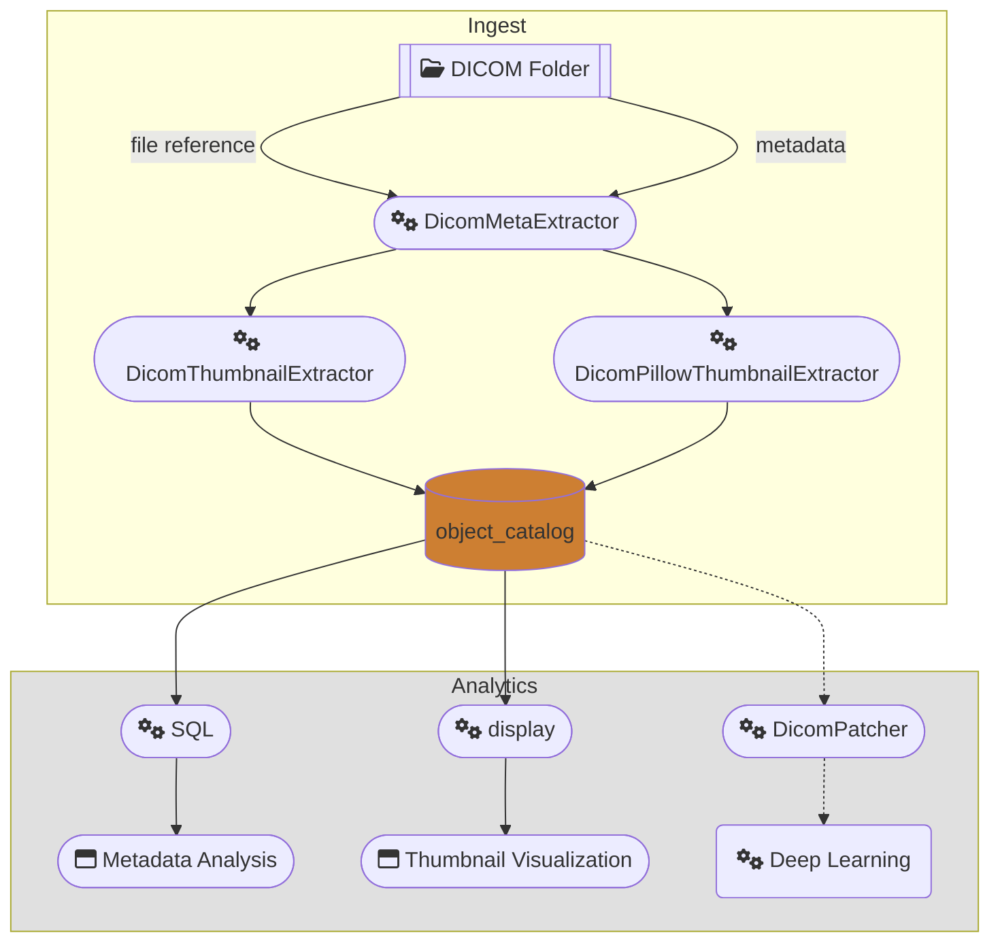

Image folder for embeds

```mermaid
flowchart TB

subgraph bronze[Ingest]
  A[[<i class='fa-regular fa-folder-open'></i> DICOM Folder]] -->|file reference|B([<i class='fa fa-gears'></i> DicomMetaExtractor])
  A -->|metadata|B
  B --> G1([<i class='fa fa-gears'></i> DicomThumbnailExtractor])
  B --> G2([<i class='fa fa-gears'></i> DicomPillowThumbnailExtractor])
  G1 --> C[(object_catalog)]
  G2 --> C
end
subgraph silver[Analytics]
  C --> D1([<i class='fa fa-gears'></i> SQL]) --> D([<i class='fa-regular fa-window-maximize'></i> Metadata Analysis])
  P --> G([<i class='fa-regular fa-window-maximize'></i> Thumbnail Visualization])
  C --> P([<i class='fa fa-gears'></i> display])
  C -.-> E([<i class='fa fa-gears'></i> DicomPatcher])
  E -.-> F(<i class='fa fa-gears'></i> Deep Learning)
end
style C fill:#CD7F32, stroke:333, color:#333
style silver fill:#E0E0E0, stroke:333, color:#333;
```
