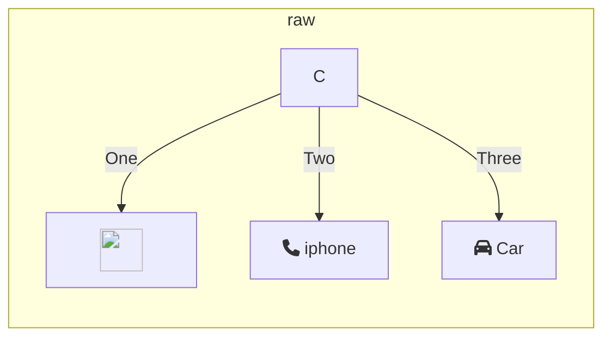

Image folder for embeds

```mermaid
flowchart LR

subgraph raw
    C -->|One| D[<img src='databricks.svg' width='40' height='40' />]
    C -->|Two| E[fa:fa-phone iphone]
    C -->|Three| F[fa:fa-car Car]
end
```
